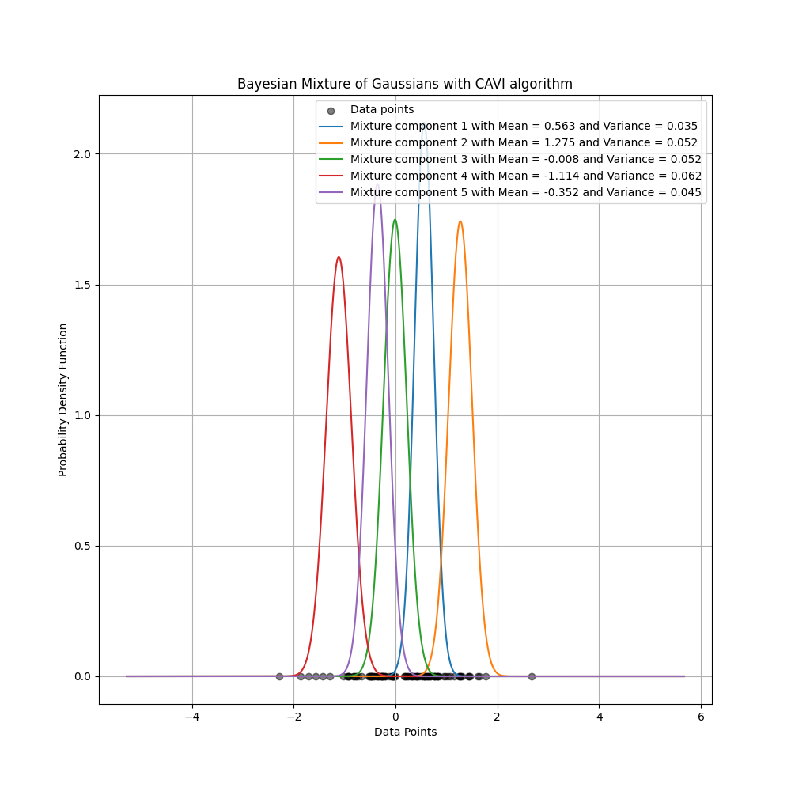

# Bayesian Mixture of Gaussians with CAVI

This repository contains a simple Python implementation of a Coordinate Ascent Variational Inference (CAVI) algorithm for fitting a one-dimensional Bayesian mixture of Gaussians. The code initializes variational parameters (cluster means, variances, and responsibilities) and iteratively updates them to approximate the posterior over cluster assignments and Gaussian parameters. The final output includes the learned cluster means and variances, prints the Evidence Lower Bound (ELBO) trajectory, and displays a plot of the mixture components overlaid on the raw data.

---

## Table of Contents

1. [Project Overview](#project-overview)  
2. [Prerequisites](#prerequisites)  
3. [Installation](#installation)  
4. [Usage](#usage)  
5. [Code Structure](#code-structure)  
6. [Algorithm Details](#algorithm-details)  
   - [E-step (Update Responsibilities)](#e-step-update-responsibilities)  
   - [M-step (Update Means & Variances)](#m-step-update-means--variances)  
   - [ELBO Computation](#elbo-computation)  
7. [Example Output](#example-output)  
8. [Customization](#customization)  
9. [License](#license)  

---

## Project Overview

A **mixture of Gaussians** assumes that each data point is generated from one of \(K\) Gaussian components. In a **Bayesian** formulation, we place priors on the component means and variances. However, computing the exact posterior \(p(\{\mu_k, \sigma_k^2\}, \{z_i\} \mid x_{1:N})\) is intractable. Instead, we use **Variational Inference**, specifically **Coordinate Ascent Variational Inference (CAVI)**, to approximate the posterior with a factorized variational distribution:
\[
q(\mu, \sigma^2, z) \;=\; \prod_{k=1}^K q(\mu_k)\,q(\sigma_k^2)\,\prod_{i=1}^N q(z_i).
\]
This script implements closed‐form updates for \(q(z_i)\), \(q(\mu_k)\), and \(q(\sigma_k^2)\) in one dimension.  

The main goals of this code are:  
- Demonstrate how to set up and run a CAVI algorithm for a simple Bayesian mixture model.  
- Monitor convergence via the Evidence Lower Bound (ELBO).  
- Visualize the learned Gaussian mixture components over the data.

---

## Prerequisites

- **Python 3.7+**  
- **NumPy**  
- **Matplotlib**  

You can install the required Python packages via:
```bash
pip install numpy matplotlib
```

## Installation

Clone this repository (or download the files) to your local machine:

```bash
git clone https://github.com/your-username/bayesian-gaussian-mixture-cavi.git
cd bayesian-gaussian-mixture-cavi
```

Ensure you have a Python environment with NumPy and Matplotlib installed.

### (Optional) Virtual Environment

If you prefer, create and activate a virtual environment:

```bash
python -m venv venv
source venv/bin/activate    # macOS/Linux
venv\Scripts\activate      # Windows
pip install numpy matplotlib
```

## Usage

The main script is contained in `cavi_gaussian_mixture.py`. By default, it:
- Samples 100 data points from a standard normal distribution
- Sets up a mixture with K=5 components and a prior variance of 1.0 for each μₖ
- Runs CAVI for 100 iterations
- Prints the ELBO at each iteration
- Prints the final cluster means and variances
- Plots the learned Gaussian densities over the data

To run the script:

```bash
python cavi_gaussian_mixture.py
```

If you prefer a Jupyter notebook, copy the same code blocks into a notebook cell and run them interactively.

## Code Structure

```
.
├── cavi_gaussian_mixture.py   # Main implementation of CAVI and plotting
└── README.md                  # This file
```

### cavi_gaussian_mixture.py

#### Imports:
```python
import numpy as np
import matplotlib.pyplot as plt
```

#### Function `cavi_algorithm(...)`
- Initializes:
  - `cavi_distribution`: N×K array of responsibilities (all zeros initially)
  - `cluster_means`: random initialization of means μₖ ∼ N(0,1)
  - `cluster_variances`: set to the prior variance σ²_prior for each cluster
- Loops for max_iterations steps:
  - **E-step**: Compute unnormalized log-likelihood of each data point under each cluster, exponentiate, normalize across clusters to form responsibilities rᵢₖ
  - **M-step**:
    - Compute effective weight wₖ = ∑ᵢ rᵢₖ
    - Update μₖ = (∑ᵢ rᵢₖ xᵢ) / (wₖ + 1/σ²_prior)
    - Update σ²ₖ = 1 / (wₖ + 1/σ²_prior)
  - **ELBO**:
    - Likelihood term: ∑ᵢₖ rᵢₖ log N(xᵢ|μₖ, σ²ₖ)
    - Entropy term: -∑ᵢₖ rᵢₖ ln rᵢₖ
  - Prints ELBO for each iteration
- After finishing iterations, prints final means and variances, and returns (cavi_distribution, cluster_means, cluster_variances, num_cluster)

#### Function `plot_cavi(...)`
- Creates a scatter plot of all data points at y=0
- Generates an x-range spanning min-3 to max+3 of data
- For each cluster k, computes the Gaussian PDF:
  ```
  pₖ(x) = 1/√(2πσ²ₖ) exp(-(x-μₖ)²/(2σ²ₖ))
  ```
  and overlays it on the same figure
- Displays a legend reporting μₖ and σ²ₖ for each component

#### Script Entry Point
```python
if __name__ == "__main__":
    data_points     = np.random.randn(100)
    num_data_point  = len(data_points)
    num_cluster     = 5
    prior_variance  = 1.0
    max_iterations  = 100

    cavi_distribution, cluster_means, cluster_variances, _ = \
        cavi_algorithm(data_points, num_data_point,
                       num_cluster, prior_variance,
                       max_iterations)

    plot_cavi(data_points, num_cluster,
              cluster_means, cluster_variances)
```

## Algorithm Details

Below is a concise summary of the key steps in the CAVI algorithm for a one-dimensional Gaussian mixture.

### E-step (Update Responsibilities)
For each cluster k:
1. Compute log p(xᵢ|μₖ, σ²ₖ) for i=1,...,N:
   ```
   log p(xᵢ|μₖ, σ²ₖ) = -½ ln(2πσ²ₖ) - (xᵢ-μₖ)²/(2σ²ₖ)
   ```
2. Exponentiate to get unnormalized responsibilities:
   ```
   r̃ᵢₖ = exp(log p(xᵢ|μₖ, σ²ₖ))
   ```
3. Normalize across k:
   ```
   rᵢₖ = r̃ᵢₖ / ∑ₖ' r̃ᵢₖ'
   ```

### M-step (Update Means & Variances)
1. Compute the "soft count" of cluster k:
   ```
   wₖ = ∑ᵢ rᵢₖ
   ```
2. Update the variational mean μₖ:
   ```
   μₖ = (∑ᵢ rᵢₖ xᵢ) / (wₖ + σ⁻²_prior)
   ```
3. Update the variational variance σ²ₖ:
   ```
   σ²ₖ = 1 / (wₖ + σ⁻²_prior)
   ```

### ELBO Computation
At each iteration, we compute:
```
ELBO = E_q[ln p(X|μ,σ²)] - E_q[ln q(Z)]
     = ∑ᵢ∑ₖ rᵢₖ [-½ ln(2πσ²ₖ) - (xᵢ-μₖ)²/(2σ²ₖ)] - ∑ᵢ∑ₖ rᵢₖ ln rᵢₖ
```
In practice, a small constant ε=10⁻¹⁰ is added inside ln(rᵢₖ + ε) to avoid numerical issues.

## Example Output

```
For 1 iterations: ELBO = -484.840
For 2 iterations: ELBO = -139.144
For 3 iterations: ELBO = -72.960
For 4 iterations: ELBO = -41.628
For 5 iterations: ELBO = -34.510
...
For 95 iterations: ELBO = -11.411
For 96 iterations: ELBO = -11.411
For 97 iterations: ELBO = -11.411
For 98 iterations: ELBO = -11.411
For 99 iterations: ELBO = -11.411
For 100 iterations: ELBO = -11.411
Final cluster means = [ 1.15870185 -0.62817977 -0.11172294  0.21785158 -1.4230639 ]
Final cluster variances = [0.03562223 0.0420317  0.04891383 0.05230675 0.07367045]
```

(Note: Because the data are randomly generated, your actual ELBO values, final means, and variances will differ. The ELBO should increase (or plateau) over iterations.)

Below is an example of the mixture component plot generated by the script:



- Black dots on the x-axis represent each data point
- Five colored bell curves (one per mixture component) illustrate the learned Gaussian densities
- The legend indicates each component's mean (μₖ) and variance (σ²ₖ)

Text output example:

## Customization

### Change Number of Clusters
Modify:
```python
num_cluster = 5
```
to any integer K ≥ 1.

### Adjust Prior Variance
- A smaller `prior_variance` (e.g., 0.1) shrinks cluster means more strongly toward 0
- A larger `prior_variance` (e.g., 10.0) yields a weaker prior

### Use Your Own Data
Replace:
```python
data_points = np.random.randn(100)
```
with:
```python
data_points = np.array([...])   # your 1D data array
num_data_point = len(data_points)
```

### Modify Number of Iterations
Change:
```python
max_iterations = 100
```
to run more or fewer CAVI updates.

### Check Convergence
- If the ELBO oscillates or decreases, consider using a larger numerical stabilization inside the entropy term (e.g., 1e-8 or 1e-6 instead of 1e-10)
- Increase `max_iterations` if ELBO has not plateaued

## License

This project is released under the MIT License. Feel free to copy, modify, and redistribute.

```
MIT License

Copyright (c) 2025 [Reza Sharifian]

Permission is hereby granted, free of charge, to any person obtaining a copy
of this software and associated documentation files (the "Software"), to deal
in the Software without restriction, including without limitation the rights
to use, copy, modify, merge, publish, distribute, sublicense, and/or sell
copies of the Software, and to permit persons to whom the Software is
furnished to do so, subject to the following conditions:
...
```

Replace `[Reza Sharifian]` with your actual name or organization.

Happy clustering and variational inference!
```
